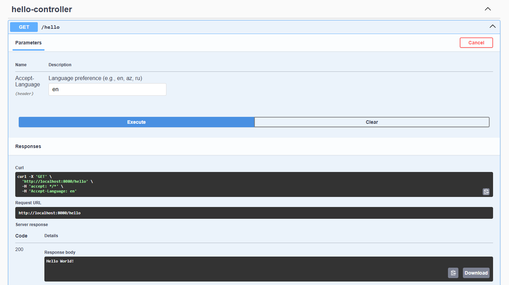

# ✨ Sample Localization API

Welcome to the Sample Localization API project!<br> 
This application demonstrates how to create an API that supports localization features.

## 🚀 Technologies Used:

* Java 21
* Gradle
* Spring Boot 3.4.4
* Swagger 3

## 🛠️ How to Run?

1. Clone the repository:

```sh
git clone https://github.com/Uzunalov/i18n-localization.git
```

2. Build and run the project:

```sh
./gradlew build
```

```sh
./gradlew bootRun
```

## 📎How to Use?

Open the [Swagger UI](http://localhost:8080/swagger-ui.html) and execute the [/hello](http://localhost:8080/hello) endpoint with the
`Accept-Language` header:


## 📌 Notes

* If the encoding of your `.properties` files is not UTF-8, change it to UTF-8.
  If you're using IntelliJ IDEA, refer to [the documentation](https://www.jetbrains.com/help/idea/encoding.html).
